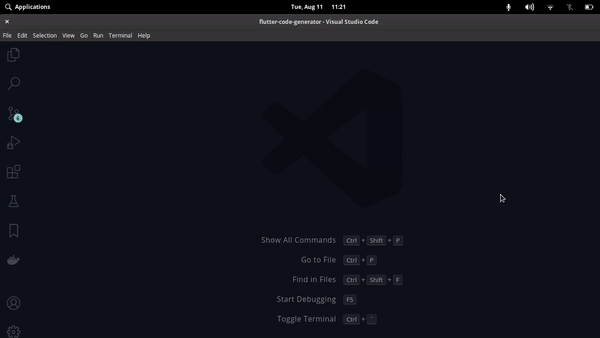
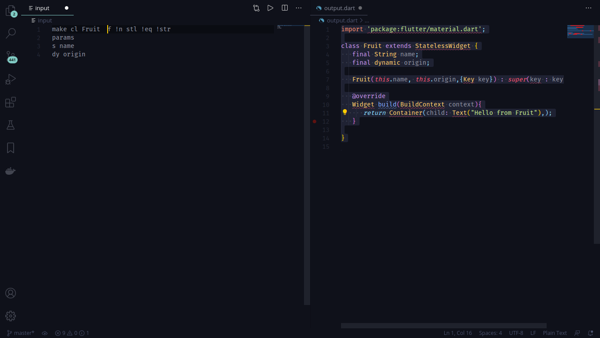
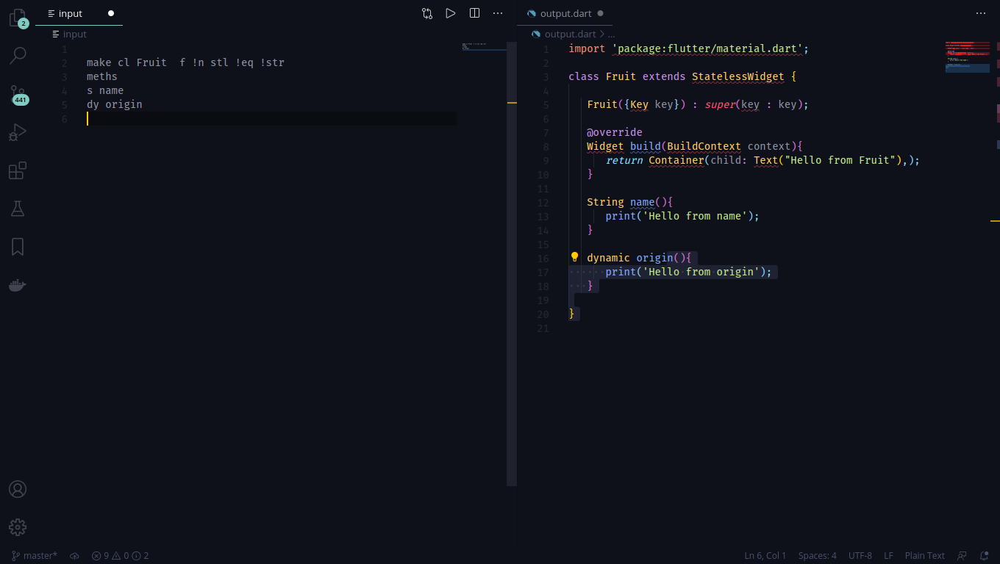
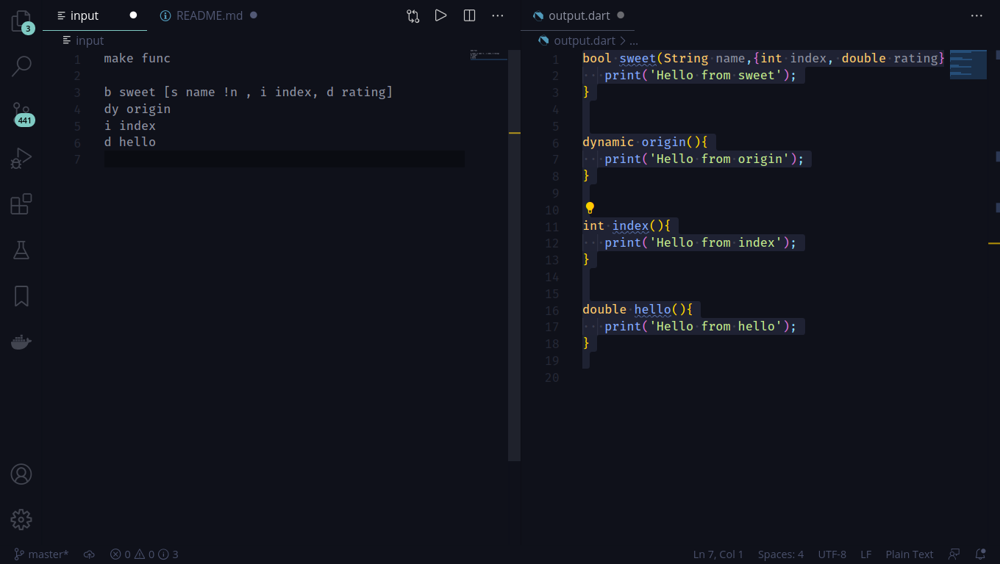

A word on Architecture: 
We bascially transform your input into data structures and output the resultant code. You could browsw the project by which you may gain thorough knowleddge of Code Generation. 
We would gladly accept your help in improving it too!


# Examples!!!
I am going to give you some examples that will help you.
```
make cl Fruit  f !n stl
params     
s name 
dy origin
```


```
make cl Fruit  f !n stl !eq !str 
meths     
s name 
dy origin
```



# Same as meths 


```
make func

b sweet [s name !n , i index, d rating]
dy origin
i index
d hello 
```



## Hello Friend I will help you be productive Do read me after that you will be able to utilize me to full potential. Just needs your 7m.

So Hello I am an exension I have a reason to exist which is to assist you to in your tough Development job in flutter. I solves a few problems which are as follows: 

Q) In dart if we do something like ```print(classObjectVariable)``` it does not show us inside of a class which could we quite unhelpfull while debugging. So how to Solve it? 

A) So I can generate toString() method of class which will make it easier to debug. As a bounus I will generate (==) check method also.

---

Q) In dart I happen to create a Class and it is tedious I had to specify each variable is final and required. So how to Solve it?

A) Well you make all variable in a class to be required and final. It is just the need of adding 'f r' at class Declaration( looks like ```make cl Fruit f r```)

---


Q) In flutter I happen to create a Stateful widget and sometime the state goes crazy.Hard time debugging. How about that?
<!-- Hmm It would be great if I could come to your mind and assist you in debugging but my creator has not give me that ability. But  -->
A) I can generate toString() method for parent State by which you can inspect the state.
Example always helps. So ```make cl stf``` or ```make cl stl``` generates stateful and stateless widget with eq and toString().

---
## Guide

Thank you could you give me some Concrete example of how to use you?

Sure so I will show you an example?
```
make cl Fruits   
params     
s name [f !n]
meths 
b sweet [s name !n , i index, d rating]
dy origin
```
I know the unknows Character looks unfamiliar but they dont worry I will guide you.

# Explanations
## Class Options
```make cl Fruit```

It means I want to make a Class Fruit you can add default options after ClassName (Fruits in our case) as follows:
    
    r !r: Required And Not Required
    n !n: Named And Not Named
    f !f: Final And Not Final
    eq !eq: Equals And Not Equals
    str !str: toString And Not toString
    stf stl: Statefull and Stateless

So do create Stateful widget with all field parameters final and required class Declaration looks like ``` make cl Fruit f r stf ``` 

---
# Params Declarations

```params```

Used to specify that params are going to follow. NOTE DO NOT ADD CLASS OPTIONS HERE OTHERWISE NO RESULT BE PRODUCED.
Param Fields

```s name [f !n]```

    's' means String

    'name' means variable names 

    '[f !n]' mean we are overriding Class Default options by    providing our own options supports

    r !r: Required And Not Required

    n !n: Named And Not Named

    f !f: Final And Not Final

# Meths Declarations

```meths```

Used to specify that methods are going to follow. NOTE DO NOT ADD CLASS OPTIONS HERE OTHERWISE NO RESULT BE PRODUCED AND CLASS OPTIONS DO NOT AFFECT METHOD IN ANY WAY.

```b sweet [s name !n , i index, d rating]```

Here 
    
    b means bool

    'sweet' means method name 

    '[f !n]' mean we are overriding Class Default options by    providing our own options supports

    '[s name !n , i index, d rating]'

    's name !n'
    's' means String
    'name' is variableName
    '!n' mean it is not named
    ---
    'i index'
    'i' means int
    'index' is variableName
    ---
    'd rating'
    'd' means double
    'rating' is variableName
    ---

```dy origin```
gives a method with name origin that returns dynamic

# Types Mapping
Here is a map of types and their Mapping

    s: 'String',
    i: 'int',
    b: 'bool',
    d: 'double',
    dy: 'dynamic',
    ls: 'List<dynamic>'


# **Have a Happy Day Ahead!**
